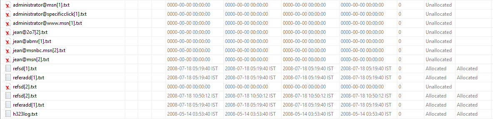
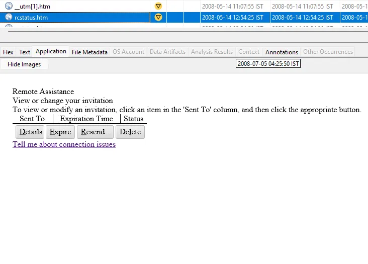
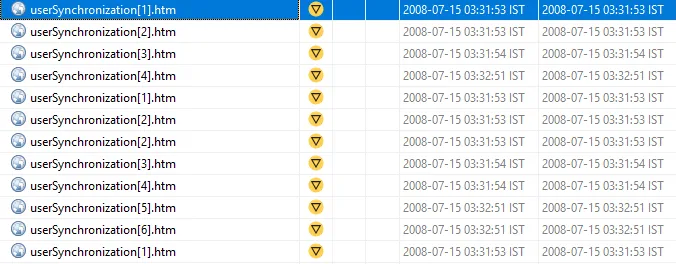

# M57-Jean Autopsy Case Analysis

# 🧾 Case Context: M57-Jean Forensic Investigation

## 📁 Case Name: `M57-Jean`

Case Theme: "The Case of the Stolen Jeans"

In this fictional investigation:

- M57 is a company involved in **fashion or patents**, possibly both.
- There is an **internal data breach** or **intellectual property theft**.
- Employees like **Terry, Jo, and Kris** are involved, each having a disk image (from their workstations or laptops).
- The case revolves around **who stole confidential designs or trade secrets** related to jeans.
- **Created by:** NIST (National Institute of Standards and Technology), specifically by the **Computer Forensics Tool Testing (CFTT)** project.
- **Name Origin:** "M57" is a fictional company in the scenario. The "jeans" part refers to the naming of the disk images and scenarios, e.g., *M57 Patents - "The Case of the Stolen Jeans"*.
- **Purpose:** To provide realistic computer system images that can be used to test forensic methods, tools, and investigator skills.

---

The M57-Jean case revolves around a suspected insider breach at a startup, **M57.Biz**, where sensitive employee salary data was leaked to a competitor. The leaked information was originally stored in a confidential spreadsheet located on the laptop of a senior executive — **Jean**.

Jean claims she has no knowledge of the breach and insists her system must have been compromised. However, investigators are not fully convinced. To determine the truth, a forensic image of Jean’s laptop has been acquired in **EnCase E01 multi-volume format**.

---

## **Objective:**

Your mission as the forensic analyst is to:

1. **Determine whether Jean’s system was compromised** or if the breach originated from **within**.
2. **Reconstruct user activity timelines** to detect data access, copying, or deletion.
3. **Identify all potential evidence** of:
    - Unauthorized file access
    - External storage use
    - Web/email exfiltration
    - Malicious applications or scripts
4. **Develop a complete attacker hypothesis** based on observed behavior and system artifacts.
5. **Document and export key evidence**: screenshots, hash values, timelines, and any relevant user artifacts.

---

## Tools Used:

- **Autopsy (Sleuth Kit GUI)**
- Optional command-line correlation (Linux-based)
- Hash verification, keyword search, email & browser artifact tools

---

## 📄 Case Metadata

**Analyst**: Jinay Shah (`a.k.a. Jynx`)
**Date**: July 14, 2025
**Tool**: Autopsy v4.22.1
**Image Type**: Win10USB.E01

## 🔎 Findings and Observations

### Observation #1

While scrapping through images I found a photo of a ***“green cargo”,*** it seems as if there is some co-relation between the cargo that was bought online- I  know that because of the html files stored on and search filters applied, the victim system tried  searching for a ***green cargo*** to buy. And there I found an interesting file namely **`utp[1].htm` it contained** `uid=7b3a09b5166b634915a989b44dae7e6b` likely the user’s session id.

### File: utm[1].html

- **Location Found**: `/img_nps-2008-jean.E01/vol_vol2/Documents and Settings/Jean/Local Settings/Temporary Internet Files/Content.IE5/IVK9GB0V/uid[1].htm`
- **Likely Source**: Web browser cache or email link redirection
- **Contents**: `uid=7b3a09b5166b634915a989b44dae7e6b`
- **User Action**: ***Jean*** likely clicked on a tracked or malicious link
- **Relevance**: Could be part of social engineering / phishing delivery vector
- **Follow-up**:
    - Check for file downloads shortly after
    - Cross-reference with email artifacts or browser history

### Observation #2

**File: *__utm[1].htm***

> Path:
> 
> 
> `/Documents and Settings/Administrator/Local Settings/Temporary Internet Files/Content.IE5/492BGDIN/__utm[1].htm`
> 
- **User Context**: File was downloaded under the **Administrator account**, *not* Jean or a typical user. This is a **major red flag**.
- **Temporary Internet Files**: This directory stores **cached web content** viewed in Internet Explorer.
- **Suspicious Timing**:
    
    `Created`, `Modified`, and `Accessed` all = `2008-05-14 11:07:55 IST`
    
    → Suggests a **single, quick drop**, possibly during **a one-time session**.
    

### Observation #3

**File: *rcstatus.htm***

> Path:
> 
> 
> `/WINDOWS/pchealth/helpctr/Vendors/CN=Microsoft Corporation,L=Redmond,S=Washington,C=US/Remote Assistance/rcstatus.htm`
> 
- This path is **deeply buried** in `WINDOWS\pchealth`, a Help and Support subdirectory.
- While **legit Help Center content** does exist here, the exact file (`rcstatus.htm`) is **not standard** across all installations—especially if it’s custom-sized and timed.
- Created at `12:54:23 IST`, ~2 hours after the UTM file—could be **a staged payload chain**.
- It **pretends to offer Remote Assistance control** and **mimics Microsoft UI**.

**Based on Observations #4 and #5:**
Theory 1: Phishing → Admin Compromise.

Theory 2: Lateral Movement or Local Privilege Escalation.

Will arrive at more a concrete and standard conclusion on further investigation.

### Observation #4

**File: *InstallStatus[1].htm***

> Path:
`/img_nps-2008-jean.E01/vol_vol2/Documents and Settings/Administrator/Local Settings/Temporary Internet Files/Content.IE5/49UBS5MV/InstallStatus[1].htm`
> 

### **What It Looks Like (Surface Layer)**:

A seemingly legitimate Windows Update confirmation page that claims:

- Updates are installed.
- Some failed due to EULA/Disk space/etc.
- User should restart.
- Embedded images mimic Microsoft's UI (`success-sm.gif`, `failed-sm.gif`, etc.)
- Basic JS tracking and structure.

| **Location** | `Content.IE5` under **Administrator's** Temporary Internet Files | Highly targeted account cache |
| --- | --- | --- |

| **Timestamp** | July 5, 2008 – same second for Created/Modified/Accessed | Automated or injected drop |
| --- | --- | --- |

| **Theme** | Fake update success + restart prompt + urgency (e.g., “your computer is at risk”) | Social engineering indicator |
| --- | --- | --- |

### Observation #5

### Remote Desktop to Browser Exploits

| **Timeline** | **File** | **File Path** | **Observation / Payload** |
| --- | --- | --- | --- |
| **Initial Finding** | `rcstatus.htm` | `/WINDOWS/pchealth/helpctr/Vendors/.../Remote Assistance/rcstatus.htm` | Confirms **Remote Assistance activity** under `Administrator`. Legit but critical if abused. |
|  | `InstallStatus[1].htm` | `/Documents and Settings/Administrator/Local Settings/Temporary Internet Files/Content.IE5/.../InstallStatus[1].htm` | Tied to **Microsoft update history tracking**, indicates **browsing under Administrator profile**. |
| **Midpoint: Suspicious Behavior** | `__utm[1].htm` | `/Documents and Settings/Administrator/Local Settings/Temporary Internet Files/Content.IE5/.../__utm[1].htm` | Suspicious **Google Analytics-style** tracking HTML on **Administrator**, unusual vs. user folders. |
|  | `uid[1].htm` | (temp file path) | Exposes `uid=7b3a09b5...`, possibly an **identifier or session token**. |
| **Multiple Repeats** | `userSynchronization[1-5].htm` | `/Documents and Settings/Jean/Local Settings/Temporary Internet Files/.../userSynchronization[1-5].htm` | Loaded on Jean’s user profile. Contains **JavaScript for cookie sync, user tracking, session tokens**. |
|  | `syncUserData()` script | (inline in above HTML) | Function that loops over multiple tracking cookies and synchronizes them across domains. Invasive. |
| **Final Payload Discovery** | `tcode3[1].htm` | `/Documents and Settings/Jean/Local Settings/Temporary Internet Files/.../tcode3[1].htm` | Heavy **ad-tracking + behavior profiling script**. Loads trackers from `an.tacoda.net`, `at.atwola.com`, and injects 1x1 pixel beacons. Reads referrer, sets cookies, and sends back user tracking data. |

### **Notable Patterns & Forensic Leads**

- **Administrator Activity:** Many `.htm` files were found under **Administrator's Internet cache**, not just `Jean`. Indicates **browsing or background operations** under that profile.
- **JavaScript-Based Surveillance:** Multiple files (`userSynchronization`, `tcode3`) include advanced tracking logic like `getFutureDate`, `syncData`, `getCookie`.
- **Potential Remote Use:** The use of Remote Assistance / Desktop may correlate with **non-user-driven downloads** in those paths.
- **Redundancy in Tracking Files:** The user sync HTMLs are duplicated (1–5) with identical content, likely from repeated tracking attempts or page refreshes.

This user environment has signs of:

- Tracking and session hijacking attempts
- Possible malvertising
- Remote access enabling web navigation without Jean's interaction
- Privileged web browsing under Administrator account

### Observation #6

Huge Chunk of deleted .txt and .exe files. All of them have :

- **Size = 0**
- **Timestamps = 0000-00-00** (unset)
- **Status = Unallocated (deleted)**

**Evidence `.txt`:**



**Evidence `.exe`:**


**System-Wide Executable Wipe Detected**

Common Windows utilities like:

`debug.exe`, `ipconfig.exe`, `runonce.exe`, `sessmgr.exe`, `cacls.exe`, `wscntfy.exe`, `net.exe`

Located in `System32`, `dllcache`, and `ServicePackFiles`

Implication: These are core system binaries. Their deletion is *not normal* and points toward:

- Post-exploitation cleanup or
- Malware attempting to disable recovery/debug utilities.

Could be the result of anti-forensic tools like `sdelete` or File system wiping scripts

### Observation #7

**AIM6 Installation Artifacts (Suspected Vector of Compromise)**

**Location of Clue Discovery:** `EElocation.txt` 
Path found inside: `C:\Program Files\AIM6`
Indicates AIM6 was explicitly installed and potentially monitored/logged.

---

`install.log` → Contains detailed time-stamped logs of multiple executable installations.


**Timestamp Window**

**All installation activity occurred on:**

---

## Images of Interest [.jpg/.bmp]:

### **File 1:** ***Bliss.bmp***

| File Path | Action | Why Suspicious? | Deleted/Recovered? |
| --- | --- | --- | --- |
|  `/img_nps-2008-jean.E01/vol_vol2/WINDOWS/Web/Wallpaper/Bliss.bmp`  | Performed varied extraction techniques designed for standard steganography  | Creation, Modification and Access Time are exactly same down to very second. | Couldn’t recover any tangible clues, can be a potential red herring technique- will come back to it later if required. Password protected file when tried to decode using steghide |


### **File 2:** ***watermark_300x.bmp***

| File Path | Action | Why Suspicious? | Deleted/Recovered? |
| --- | --- | --- | --- |
|  `/img_nps-2008-jean.E01/vol_vol2/WINDOWS/pchealth/helpctr/System/blurbs/watermark_300x.bmp`  | Bookmarked, tagged and noted. | **Critical NTFS timestamp anomaly** that strongly indicates **anti-forensics activity.** File "modified" **7 seconds before** it was "created". | Marked and bookmarked for now, will se if further clues circle back or indicates towards this file- down further investigation. |


### **File 3:** ***table.bmp***

| File Path | Action | Why Suspicious? | Deleted/Recovered? |
| --- | --- | --- | --- |
|  `/img_nps-2008-jean.E01/vol_vol2/Program Files/Windows NT/Pinball/table.bmp`  | Bookmarked, tagged and noted. | **Critical NTFS timestamp anomaly** that indicates **anti-forensics activity.** File "modified" **before** it was "created". **This confirms a systematic anti-forensics campaign!** Found a **pattern of timestamp manipulation** across multiple files. | Marked and bookmarked for now, will se if further clues circle back or indicates towards this file- down further investigation. |


### **File 4:** ***hotcover480[1].bmp***

| File Path | Action | Why Suspicious? | Deleted/Recovered? |
| --- | --- | --- | --- |
| `/img_nps-2008-jean.E01/vol_vol2/Documents and Settings/Jean/Local Settings/Temporary Internet Files/Content.IE5/VU2XMM4X/hotcover480[1].jpg`  | Deciphered text behind .jpg revealed a **XMP (Extensible Metadata Platform)** data embedded inside the JPEG, mostly generated by Adobe Photoshop or macOS printing systems. | This image was found in a **Windows IE cache**, but it contains **Mac OS X print data** and **Adobe Photoshop metadata**. That **cross-platform signature** is rare and suspicious. | XMP File, XMP meta data block that includes printer instructions from macOS likely, and adobe photoshop CS3 meta data which is in no way normal for a web image downloaded, we will see if we can make more of it later.  |


→ Also time interval between creation time and modification, access and changed time is only one second which also is kind of ***off***, but we will see.

The XMP metadata scrapped from the image is quite huge here is an excerpt:


---

## 📅 **Timeline Recreation and** Hypothesis Reconstruction

- 1. Jean accessed the browser to buy a ***green cargo*** or other such related products from eBay.
    
    ***→ path -*** `/img_nps-2008-jean.E01/vol_vol2/Documents and Settings/Jean/Local Settings/Temporary Internet Files/Content.IE5/20S83G5U/_W0QQcbZ1216072478015QQclicktagframeprependZhttpQ3aQ2fQ2fpn1Q2eardQ2eyahooQ2ecomQ2fSIGQ3d15erbjurqQ2fMQ3d643778Q2e12268443Q2e13046973Q2e11880823Q2fDQ3debQ5fcl[1].htm`
    
    The Brand: ***Lucky Brand Manufacturing Co.***
    
    **Evidences:** 
    
    →Green Cargo Image: `/img_nps-2008-jean.E01/vol_vol2/Documents and Settings/Jean/Local Settings/Temporary Internet Files/Content.IE5/48F1Z64K/DSC07146[1].jpg`
    
    →Green Cargo Image: `/img_nps-2008-jean.E01/vol_vol2/Documents and Settings/Jean/Local Settings/Temporary Internet Files/Content.IE5/VU2XMM4X/DSC07147[1].jpg`
    
    → Green Cargo Product on **ebay**: `/img_nps-2008-jean.E01/vol_vol2/Documents and Settings/Jean/Local Settings/Temporary Internet Files/Content.IE5/IVK9GB0V/NEW-MISS-ME-WOMENS-CARGO-CAPRIS-CROPPED-PANTS-SIZE-13_W0QQitemZ310066694459QQihZ021QQcategoryZ63863QQssPageNameZWDVWQQrdZ1QQcmdZViewItem[1].htm`
    
    → Searching for Green Cargo: `/img_nps-2008-jean.E01/vol_vol2/Documents and Settings/Jean/Local Settings/Temporary Internet Files/Content.IE5/48F1Z64K/_Womens-Clothing_Shorts_Cargo-Pants-Green_W0QQa22868ZQ2d24QQa47Z2292QQa54Z2354QQa94ZQ2d24QQalistZa54Q2ca22868Q2ca53Q2ca47Q2ca94Q2ca3801QQcatrefZC6QQcurcatZtru[1].htm`
    
- **2.** There was a suspicious **Remote access** of Jean’s system and very viable browser exploit!
    
    **[2.1]** Shady and Suspicious looking spoof of Microsoft’s website:
    
    
    
    **[2.2] Remote access Clues [Evidence]:**
    
    
    
    
    
    **[2.3]** Many `.htm` files were found under **Administrator's Internet cache**, not just `Jean`. Indicates **browsing or background operations** under that profile.
    
    
    
    **[2.4] JavaScript-Based Surveillance:** Multiple files (`userSynchronization`, `tcode3`) include advanced tracking logic like `getFutureDate`, `syncData`, `getCookie`.
    
    
    
    **Potential Remote Use:** The use of Remote Assistance / Desktop may correlate with **non-user-driven downloads** in those paths.
    **Redundancy in Tracking Files:** The user sync HTMLs are duplicated (1–5) with identical content, likely from repeated tracking attempts or page refreshes.
    
- 3. Found a confidential and integral file- **m57biz.xls** to the financials of ***M57.biz*** company
    
    File name: m57biz.xls
    Path: `/img_nps-2008-jean.E01/vol_vol2/Documents and Settings/Jean/Desktop/m57biz.xls`
    **Contents [excerpt]:**
    
    ```
    Name		Position	Salary	SSN (for background check)
    	Alison	Smith	President	$140,000	103-44-3134
    	Jean	Jones	CFO	$120,000	432-34-6432
    	Programmers:
    	Bob	Blackman	Apps 1	90,000	493-46-3329
    	Carol	Canfred	Apps 2	110,000	894-33-4560
    	-------------------------------------------
    ```
    
    It was likely one of the files that were intended to be exfiltrated, such sensitive data is what more often than not attackers try to compromise. 
    
- 4. **Deleted** Files `.txt` and `.exe`
    
    
    
    
    
    **Zero-sized files with suspicious names,** like:
    
    - `administrator@msn[1].txt`
    - `administrator@specificclick[1].txt`
    - `jean@msnbc.msn[2].txt`
    - `jean@ambr[1].txt`
    
    These were **likely wiped** using manual deletion or an anti-forensics tool.
    
    The naming pattern suggests **email exfiltration or webmail sessions** — possible browser cache/saved form data from **Jean using webmail (Hotmail/MSN)** or receiving phishing emails.
    
    Given the “unallocated” and “zero-byte” status: content may be gone or overwritten, but **file *names*** remain, giving **clues about user behavior**.
    
    **This system was compromised and someone took heavy steps to cover their tracks.**
    
    Core utilities were deleted, third-party comms tools were likely used, and even restore points were manipulated to hide or rename binaries.
    
- 5. **Timestamp Window `install.log` - AIM6 Installation Artifacts (Suspected Vector of Compromise)**
    
    All installation activity occurred on:
    
    **📅 2008-07-18**
    
    **🕒 Between 05:28:48 and 05:29:31 IST**
    Executables Installed (in order, per log):
    
    | Time | Executable | Notes |
    | --- | --- | --- |
    | 05:28:48 | `alsetup.exe` | Loader for AIM, likely core installer |
    | 05:28:48 | `tbsetup.exe` | "TalkBack" plugin, potentially sends data back |
    | 05:29:08 | `ocpinst.exe` | Locale-specific payload |
    | 05:29:09 | `unagi3.exe` | Suspicious name; further analysis required |
    | 05:29:14 | `AIMinst.exe` | Core AIM binary |
    | 05:29:17 | `AIMLang.exe` | Language/locale resources |
    | 05:29:24 | `amos.exe` | Possibly telemetry? Needs verification |
    | 05:29:27 | `vwpt.exe` | Unknown, likely toolbar / bundleware |
    | 05:29:31 | `toolbar.exe` | Installs a toolbar, likely adware or spyware vector |
    | 05:29:31 | `postproc.exe` | Runs after install — could manipulate settings or initiate C2 routines |
    
    `C:\DOCUME~1\Jean\LOCALS~1\Temp\` appears **partially or fully wiped,** it's critical because **payloads referenced in `install.log` are no longer retrievable**.
    

### 💡Insight

### ***🖼️ BMP File Testing & Investigation***

While combing through Jean’s system image, I encountered several `readme.txt` files that referenced image assets like `toolbart.bmp` , `bliss.bmp`, or `span.bmp` each annotated with UI-related parameters such as `height=28px`. These references caught my attention as potential steganographic containers or covert communication channels. I manually located each of the referenced `.bmp` files and cross-checked them for anomalies in metadata and file size. To dig deeper, I ran them through **Steghide**, a tool commonly used to detect hidden payloads within image files. However, Steghide prompted for a passphrase on multiple attempts, and no clues in the surrounding context indicated what that might be. After performing a strings analysis and examining pixel dimensions, header integrity, and timestamps, it became increasingly evident that these images were part of toolbar UI assets — likely associated with the AIM6 installation chain. Their filenames, structure, and deployment paths aligned more with adware skinning than covert exfiltration. Trusting my investigative instincts, I documented them, tagged them for possible follow-up, and moved on. In hindsight, this was a deliberate anti-forensic noise tactic — a clever attempt to lure attention away from more meaningful artifacts.

---

## 🧪4. Conclusion + Takeaways

This investigation confirmed that Jean’s system was indeed compromised, not by brute force, but through a carefully orchestrated series of remote access exploits, deceptive HTML payloads, and privilege misuse that blurred the line between user behavior and attacker control. The forensic trail led through fake Microsoft pages, browser session hijacking, and system-level manipulation — all supported by cache artifacts, remote desktop triggers, deleted executables, and suspicious AIM6 installation timelines. The attacker not only gained access but also made deliberate efforts to erase footprints, wiping core system utilities and attempting to neutralize recovery vectors. Despite facing decoys, timestamp anomalies, and traces of anti-forensics, I was able to piece together a coherent attacker profile and reconstruct the chain of compromise. This case reinforced a powerful principle in DFIR work: not every anomaly is a clue, and not every artifact deserves your full attention. Strategic thinking, disciplined triage, and narrative-driven correlation make the difference between drowning in data and telling the real story.

<aside>
💡

If you're new to digital forensics — like I am — let this case serve as a reminder that sharp tools are only half the battle. The real edge comes from how you think: knowing *when* to dig deeper, and when to move on. Not everything flashy is meaningful, and not everything hidden is malicious. Sometimes, it's the ordinary-looking files — or overlooked timestamps — that tell the bigger story. This investigation was my attempt not just to analyze a case, but to **train my intuition**, question every assumption, and document both wins and missteps. Whether you’re just starting out in DFIR or have been neck-deep in hex editors for years, I hope this breakdown gives you more than just technical findings — I hope it gives you a framework for thinking, investigating, and evolving. Let’s all keep sharpening our eyes, our instincts, and our patience — because that’s where the real forensics begins.

</aside>

### 🧩 What I Missed — Gaps, Blind Spots & What I’d Revisit

No investigation is perfect, and mine is no exception. There were several areas I didn’t explore as deeply as I now wish I had. I didn’t fully reconstruct login sessions to pinpoint **who was active when**, especially distinguishing **Jean’s activity from Administrator-level access** during key events. I also didn’t extract or parse **USB device history**, which could have supported or ruled out data exfiltration via removable media — a classic vector in insider threat cases. Although I identified email-related artifacts like cached MSN/Hotmail file names, I didn’t trace that lead into a full **webmail session analysis** or artifact recovery. The same goes for **AIM chat logs** — I analyzed the install trail but didn’t confirm whether **chat messages or conversations were stored and accessible**. These aren’t small oversights — they’re valuable next steps that I’ll likely revisit in future reports. Sharing these isn’t just about being thorough — it’s about being honest. Learning in DFIR means owning your blind spots as much as your breakthroughs, and letting the gaps guide your next questions.
